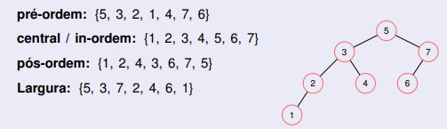
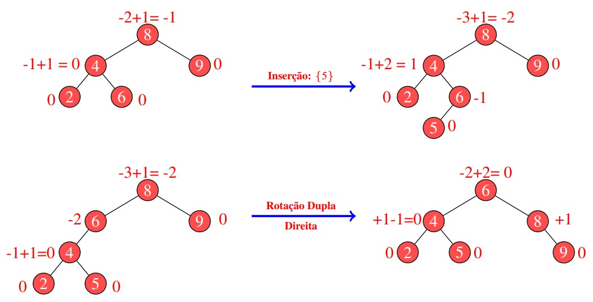
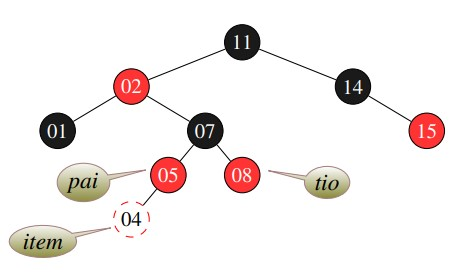

# Comparação das Estruturas em Árvore


[](https://code.visualstudio.com/docs/?dv=linux64_deb)

## Sumário

<!--ts-->
   * [Problema Proposto](#problema-proposto)
   * [Árvores](#árvores)
      * [Árvores Binárias de Busca](#árvores-binárias-de-busca)
        * [Inserção](#na-inserção)
        * [Remoção](#na-remoção)
        * [Pesquisa](#na-pesquisa)
        * [Percorrer](#para-percorrer)
      * [Árvores AVL](#árvores-avl)
        * [Fator de balanceamento](#cálculo-de-balanceamento)
        * [Rotações](#rotações)
        * [Inserção e Remoção](#inserção-e-remoção)
      * [Árvores Red Black](#árvores-red-black)
        * [Inserção](#na-inserção)
        * [Remoção](#na-remoção)
      * [Comparação das Árvores](#comparação-das-árvores)
   * [Map e Unordered Map](#map-e-unordered-map)
   * [Vector](#vector)
   * [Lógica](#lógica)
   * [Resultados e Análises](#resultados-e-análises)
   * [Bibliotecas](#bibliotecas)
   * [Compilação e Execução](#compilação-e-execução)
   * [Contato](#contato)
<!--te-->

## Problema Proposto
<div align="justify"> Objetivo de comparar as estruturas de árvores binárias, rubro-negras e AVL, observando seu comportamento sob diferentes volumes de dados. Para tanto, elaborar arquivos que contenham 500 , 5000 , 50.000 , 500.000 entradas numéricas do tipo ponto flutuante. Para tanto, tentar evitar repetições de valores em grande escala para que possamos ter uma estrutura profunda. Considerar produzir os menores a partir dos maiores volumes de forma randômica. Feito a isso, vamos testar os seguintes processos:

1) Qual o tempo gasto com pesquisa para um arquivo de entrada com 10.000 consultas. Considere como consulta a busca de um determinado número na estrutura escolhida. Para cada pesquisa, é preciso remover o elemento da árvore, retornando esse número para o usuário. Então, considere o processo de remoção como parte final do processo. 

2) Qual o tempo necessário para montar a estrutura em memória. 

3) Qual o ganho dessas estruturas ao compará-las a vetores ordenados e aplicados à pesquisa binária. Qual o tempo gasto com a ordenação do vetor? Foi possível produzi-lo em memória? 

4) Adotando como estrutura o map e unorder_map do C++, há ganhos maiores nesse processo de pesquisa?

Elaborar um relatório detalhando a implementação dessas estruturas, funcionamento da aplicação, exemplo de resultado, modo de compilação e conclusões. Considerar essa última seção como uma discussão de quando adotar cada estrutura acima citada e o por quê de tal escolha. Para toda essa discussão, apresentar gráficos que demonstrem os resultados obtidos durante o processo de análise. 
</div>

## Árvores

Uma estrutura de dados Árvore é um conjunto finito de elementos em que cada elemento é chamado nó e o primeiro elemento é chamado de raiz da árvore.

É uma estrutura de dados que organiza seus elementos de forma hierárquica, onde existe um elemento que fica no topo da árvore, chamado de raiz e existem os elementos subordinados a ele, que são chamados de nós filhos. Cada nós filho pode conter zero, um ou mais de um nós filhos. Os nós filhos que não contém outros nós filhos são chamados de nós folha.

A estrutura de dados Árvore é uma estrutura que usa ponteiros para representar os nós filhos, ou seja, trata-se de uma estrutura dinâmica.

A estruturas de dados Árvore não é linear, ou seja, os elementos que as compõem não estão armazenados de forma sequencial e também não estão todos encadeados como em uma lista.

Em uma estrutura de dados Árvore cada elemento armazena um tipo de dado e ponteiros para o elemento à esquerda e à direita, o que permite a inserção dos valores na árvore de forma recursiva.

<div align="center">

  </div>
 
<br>

### Árvores Binárias de Busca
-------------------------------------------------
Uma árvore binária de busca é uma árvore que possui elementos menores que a raiz armazenados na sub-árvore da esquerda e elementos maiores que a raiz na sub-árvores da direita.

#### Na inserção:

- O primeiro elemento inserido assumirá o papel de raiz da árvore;
- Todo novo elemento entrará na árvore como uma folha;
- Se o elemento for menor ou igual à raiz será inserido no ramo da esquerda. Caso contrário, no ramo da direita.

#### Na remoção:
- Se o elemento a ser removido é um nó folha (sem filhos à esquerda e à direita), basta apontar o ramo onde ele se encontra do nó pai para null;
- Se o elemento a ser removido possui apenas um filho (à direita ou à esquerda), o filho assume seu lugar no ramo onde ele se encontra do nó pai;
- Se o elemento a ser removido possui dois ou mais filhos nos dois ramos, temos dois casos:
  - Se o elemento está no ramo direito de seu pai, pega-se o filho direto desse elemento, anda-se o mais a esquerda possível e substitui-se;
  - Se o elemento está no ramo esquerdo de seu pai, pega-se o filho esquerdo desse elemento, anda-se o mais a direita possível e substitui-se.

#### Na pesquisa:
- Verifica se a árvore é diferente de null;
- Compara a chave que está na raiz:
  - Se a chave for menor, vai para subárvore esquerda;
  - Se a chave for maior, vai para subárvore direita;
- Repete-se o processo recursivamento até que a chave procurada seja encontrada ou um nó folha seja atingido.
  
#### Para percorrer:
- Profundidade:
  - **Pré-ordem:** raiz, sub-árvore esquerda, sub-árvore direita
  - **Central (ou em ordem):** sub-árvore esquerda, raiz, sub-árvore direita
  - **Pós-ordem:** sub-árvore esquerda, sub-árvore direita, raiz

- Largura: imprime por níveis, da raiz para baixo. Utiliza uma fila de apoio.

Exemplo:
<div align="center">

  </div>
  
### Árvores AVL
--------------------
As árvores binárias de pesquisa são, em alguns casos, pouco recomendáveis para as operações básicas (inserção, remoção e busca). Pois, quando as árvores binárias de pesquisa estão desbalanceadas, as operações básicas se tornam mais lentas (O(n)). Garantindo o balanceamento, as consultas, inserções e remoções apresentarão custo em O(logn).
As árvores AVL são um exemplo de árvores balanceadas, elas foram introduzidas por Adelson Velskii e Landis em 1962, seu nome inclusive é a junção da inicial de seus criadores. Para garantir o balanceamento, a AVL calcula o desequilíbrio a partir da profundidade (nível) do nó mais distante de cada subárvore. Caso esse se encontre com um índice de desbalanceamento maior ou igual a 2, a árvore é recomposta por rotações. Esse cálculo é refeito para cada inserção e remoção. No caso de pesquisa e caminhamento em árvores AVL os métodos são os mesmos que os da árvores de busca binária.

#### Cálculo de balanceamento 

Para obter o cálculo:
- Começamos atribuindo zero para todo nó folha da árvore
- Subimos um nível e somamos a subárvore a direita e subárvore esquerda
   - Ao avaliar a altura leve em conta que a subárvore direita leva para seu pai, sempre, valores positivos enquanto a subárvore esquerda leva valores negativos.
- Verifica-se se o resultado do calculo excede em uma unidade e, se exceder, a árvore estará desbalanceada e deve ser recomposta.

Por questões de eficiência, o valor obtido do balanceamento, para cada nível processado, é armazenado junto aos dados de cada nó, sendo esse atualizado a cada operação.

Exemplo de um árvore AVL:

<div align="center">

 </div>

#### Rotações
As rotações acontecem quando a árvore está desbalanceada e elas podem ser de quatro tipos: simples à esquerda, simples à direita, dupla à esquerda e dupla à direita.

- **Simples à esquerda:** pai do nó vira o filho esquerdo do nó, pai do nó passa a ser o pai do pai do nó e o filho direito do antigo pai do nó passa a ser o filho esquerdo do nó, se houver.

- **Simples à direita:** pai do nó vira o filho direito do nó, pai do nó passa a ser o pai do pai do nó e o filho esquerdo do antigo pai do nó passa a ser o filho direito do nó, se houver.

- **Dupla à esquerda:** aplica-se uma rotação simples à direita no filho direito do nó, e posteriormente, aplica-se um rotação simples à esquerda no nó desbalanceado.

- **Dupla à direita:** aplica-se uma rotação simples à esquerda no filho esquerdo do nó, e posteriormente, aplica-se um rotação simples à direita no nó desbalanceado.

Exemplo de rotação simples à direita:

<div align="center">

  </div>

Exemplo de rotação dupla à esquerda:

<div align="center">

  </div>


#### Inserção e remoção:
Os processos de remoção e inserção em árvores AVL são similares à aos de uma árvore binária de busca. Todavia, é preciso verificar o balanceamento e, se necessário, aplicar algumas das rotações.


### Árvores Red Black
------------------------
As árvores vermelho e preta, bem como a AVL, são modelos que se enquadram no grupo de estruturas de árvores balanceadas. Elas contém, além da variável para representar o conteúdo do nó, os ponteiros para os filhos direitos e esquerdos, como as outras ávores, elas tem um ponteiro para o pai e um bit para representar a cor (vermelho ou preto).
Ao restringir suas inserções e remoções pela coloração de seus nós, a árvore vermelho e preta garante que nenhum de seus caminhos terá comprimento maior que duas vezes (2x) o comprimento de qualquer outro caminho existente na árvore. Esse fator faz com que esse modelo de estrutura seja aproximadamente balanceada.

#### Propriedades:
- Todo nó é vermelho ou preto;
- A raiz é sempre preta, mesmo sendo o único nó;
- Todo nó folha define seus filhos em null como sendo pretos;
- Se um nó é vermelho, então ambos os vizinhos são pretos;
- Para todo nó, todos os caminhos até as folhas apresentam o mesmo número de nós pretos;
- Para cada nova inserção, o nó criado começa com a cor vermelha;

#### Inserção:
--------
A operação de inserção pode ser realizada em uma árvore vermelho e preta em tempo de O(logn)
Os passos para executar essa operação são definidos abaixo:
- Faça uso do método de inserção da árvore binária para inserir um novo nó x na árvore t e deixe-o com a cor vermelha
- Para garantir que a árvore se encontra balanceada, o método de inserção é modificado para trabalhar com rotações e validação das colorações de cada nó.

Nessa estrutura são necessárias somente as rotações simples a direita e a esquerda.

O que ocorre com a árvore para manter seu balanceamento após uma inserção depende da cor dos nós de seus vizinhos. Para compreender seu balanceamento precisamos voltar a avaliar suas propriedades. As propriedades que mais exigem do algoritmo são a 2ª e 4ª, que precisam ser verificadas e avaliadas sob três casos distintos.

##### Caso 1
Quando o pai e o tio de um nó a ser inserido são vermelhos, basta trocar a cor do pai e do tio para preta e do avô (pai do pai) para vermelha. O avô se torna o novo item da recursão e os ponteiros são reorganizados um nível acima. Veja no exemplo a inserção do 4 na árvore:

<div align="center">

  </div>
  
  <div align="center">

  </div>
  
A situação acima nos leva para o caso 2.
 
 ##### Caso 2
 Quando o tio de um item é preto, o item e seu pai são vermelhos e o item é o filho da direita, acontece uma rotação para a esquerda a partir da posição do pai e do item.
 
  <div align="center">

  </div>
  
A situação acima nos leva para o caso 3.

##### Caso 3
Quando o tio de um item é preto, o item e seu pai são vermelhos e o item é o filho da esquerda, deve-se modificar a cor do item do nível acima e gerar uma rotação para a direita.

  <div align="center">

  </div>
  
Assim, temos a nossa árvore do exemplo em acordo com as propriedades da Red Black.

#### Remoção:
-----
A operação de remoção também pode ser realizada em uma árvore vermelho e preta em tempo de O(logn).
Na remoção, temos 5 casos.

##### Caso 1
Quando o nó a ser removido é vermelho e possui apenas um filho ou não possui filhos, a remoção é análoga a de uma ávore binária comum. Veja no exemplo a remoção do 18 na árvore:

<div align="center">

  </div>
  

 ##### Caso 2
 Quando o nó a ser removido é vermelho e seu sucessor também é vermelho, a remoção também é análoga a de uma árvore binária comum. Veja no exemplo a remoção do 33 na árvore:
 
  <div align="center">

  </div>
  
A situação acima nos leva para o caso 3.

##### Caso 3
Quando o nó a ser removido é preto e seu sucessor é vermelho, removemos o nó, substituimos pelo sucesso e pintamos o sucessor de preto. Veja no exemplo a remoção do 38 na árvore:

  <div align="center">

  </div>
  
##### Caso 4
Problema do duplo preto (quando retiramos um nó preto), foge da propriedade do mesmo número de pretos até o final da árvore e podemos ter mais 4 casos.
Para compreendê-lo, considere a seguinte nomeclatura:

- z: O nó a ser removido.
- y: o sucessor de z.
- x: O filho do sucessor antes de qualquer modificação.
- w: O irmão de x antes da remoção de z

**Caso 4.1:** O irmão w de x é vermelho. Troca-se as cores de w e x.pai e realiza-se rotação à esquerda tendo como ponto de observação x.pai. Isso nos leva aos demais casos citados.

  <div align="center">

  </div>
  
**Caso 4.2:** O irmão w de x é preto e ambos os filhos de w são pretos. Atualiza-se w para vermelho e x levando-se para o se pai. Repete-se o processo a partir do novo x.

  <div align="center">

  </div>
  
**Caso 4.3:** O irmão w de x é preto, o filho esquerdo de w é vermelho e o da direita preto. Troca-se a cor de w e de seu filho esquerdo. Rotaciona a árvore para a direita usando como pivô w. Neste ponto, o novo irmão wde x é preto com o filho da direita na cor vermelha, o que nos leva ao caso 4.4.

  <div align="center">

  </div>
  
**Caso 4.4:** O irmão w de x é preto e o filho direito de w é vermelho. Rotaciona a árvore para a esquerda usando como pivô x.pai. w é pintado com a cor de x.pai
x.pai é pintado de preto. Pinta-se o filho direito de w de preto.

  <div align="center">

  </div>
  
##### Caso 5
Quando o nó a ser removido é vermelho e x, irmão de sucessão, é preto, pinta-se o x de vermelho e resolve-se os problemas pelos casos 4.

## Comparação das Árvores

|               | Binária                                        |  AVL                                                                     |   Red Black                               |
| --------------| -----------------------------------------------|------------------------------------------------------------------------- |------------------------------------------|
|  Rotações     | não possui                                     | simples a esquerda e a direita, dupla a esquerda e a direita             | simples a esquerda e a direita         |
|  Pesquisa     | O(n) no pior caso                              | log(n)                                                                   |  log(n)                                   |
|  Inserção     | O(n) no pior caso                              | log(n) + Balanceamento                                                   |  log(n) + Balanceamento                   |
|  Deleção      | O(n) no pior caso                              | log(n) + Balanceamento                                                   |  log(n) + Balanceamento                   |

## Map e Unordered Map

```C++ 
map < double, int > map 
```

O map é um contêiner que armazena elementos em pares chave-valor. Ele armazena apenas chaves exclusivas, existindo apenas um valor para cada chave. Internamente, os elementos em um map são sempre ordenados por sua chave seguindo um critério de ordenação fraco estrito específico indicado por seu objeto de comparação interno. No exemplo de declaração acima, o valor chave é o double e o valor mapeado é o inteiro.
Para inserir dados no map usa-se a função insert, passando como parâmetros o par de dados que deseja-se inserir. Para acessar é necessário utilizar um iterator que pega o começo do map com a função begin. A partir desse acesso, é possível excluir por meio da função erase. As operações de pesquisa, remoção e inserção têm complexidade logarítmica.

```C++ 
unordered_map < double, int > umap 
```

O unordered map, como o próprio nome indica, é um map onde o elemento não é classificado em nenhuma ordem específica em relação a seu valor-chave ou valor mapeado, ou seja, desordenado. Ele é implementado usando tabelas hash em C++.

A estrutura de ambos pode ser melhor vizualidade na imagem abaixo:
<div align="center">

  </div>

Quando comparamos o map e unordered map obtemos as seguintes conclusões:

<p></p>
<div align="center">

|                        | Map                                            |  Unordered Map                                                           |                  
| -----------------------| -----------------------------------------------|------------------------------------------------------------------------- |
|  Ordenação             | ordem crescente (por padrão)                   |  não tem                                                                 |
|  Implementação         | auto balanceamento como o da árvore Red-Black  |  Tabela Hash                                                             |
|  Tempo de pesquisa     | log(n)                                         | O(n) no pior caso                                                        |
|  Tempo de inserção     | log(n) + Rebalanceamento                       | mesmo da pesquisa                                                        |
|  Tempo de deleção      | log(n) + Rebalanceamento                       | mesmo da pesquisa                                                        |
</div>


## Vector 
O vector é um contêiner que organiza elementos de um determinado tipo em uma sequência linear. Ele permite acesso aleatório rápido a qualquer elemento e adições e remoções dinâmicas de e para a sequência. A imagem abaixo exemplifica a estrutura de um vector do tipo double.

<div align="center">

  </div>
  
Ele possui algumas operações mais práticas e didáticas que podem ser combinadas a outras funções para facilitar o desenvolvimento de operações complicadas. Para inserir no final, por exemplo, basta usar a função push_back, passando como parâmetro o valor que deseja inserir. Já para remover de qualquer posição, basta usar o erase, combinado com o iterator retornado pela função begin, somado com a posição de onde se deseja retirar o elemento.
  
<div align="center">

  </div>
  
  Outro exemplo de facilidade são as funções utilizadas no presente algoritmo, ambas da biblioteca `algorithm`, as funções `sort` e `binary_search` , com a ajuda das funções end e begin, que indicam o começo e o fim do vector, realizam operações custosas sem a necessidade de subprogramas auxiliares.
  
  Sort:

  <div align="center">

  </div>
    
Binary Search + Erase:

  <div align="center">

  </div>
    
    
## Lógica
Os arquivos de entrada e consulta foram gerados a partir dos arquivos geraArquivo .cpp e .hpp do projeto. Com a função uniform_real_distribution gera-se um double randômico no intervalo de 1 a 300 que é inserido no arquivo.

Aplicando os métodos das estruturas detalhados anteriormente, as operações princpais ocorrem nos arquivos testes .cpp e .hpp.

- As funções iniciadas com a palavra cria, criam as estruturas a partir da quantidade de dados passada, lendo do arquivo de 500mil entrada, e retorna o tempo do processo. 
- As funções iniciadas com as palavras testSearch, realizam a pesquisa e a remoção nas estrutura de acordo com os números lidos do arquivo e retorna o tempo do processo.
- As funções iniciadas com a palavra test seguida pelo nome de uma estrutura, são responsáveis por unir as duas acimas para cada tamanho de entrada de dados: 500, 5 mil, 50 mil e 500 mil. A única execeção é a do vector, onde o testSearch é chamado na função de criação da estrutura.

O main possui um menu feito com do while e switch onde é possível escolher qual estrutura será testada. Sendo 1 para Árvore Binária, 2 para AVL, 3 para Red Black, 4 para Map, 5 para Unordered Map, 6 para Vector e 0 para sair do programa.
  
## Resultados e Análises
A configuração da CPU onde o programa foi executado se encontram abaixo:

  <div align="center">

  </div>
  
Nessas condicões, os tempos de inserção foram:

  <div align="center">

  </div>
  
Essa tabela nos gera o seguinte gráfico:

  <div align="center">

  </div>
  

Os tempos de busca + remoção, onde o nó encontrado é retornado para o usuário, foram:

  <div align="center">

  </div>

Nesse caso, como houve uma enorme diferença entre o tempo de pesquisa do vector na estrutura de 500 mil entrada em comparação com as outras estruturas, separamos a análise em dois gráficos, para que a visualização não seja comprometida. O primeiro gráfico, não inclui os tempos do vector e o segundo inclui.

  <div align="center">

  </div>
  
<div align="center">

  </div>

## Bibliotecas

- **iostream:** declara objetos que controlam a leitura e a gravação nos fluxos padrão.
- **random:** define instalações para a geração aleatória de números, permitindo a criação de números aleatórios distribuídos uniformemente.
- **iomanip:**  define vários manipuladores que usam um único argumento cada, no nosso algoritmo, usou-se o `setw` e `setprecision`, para definir o número de casas decimais de um número a serem exibidas.
- **time.h e chrono:** usadas para mensurar o tempo de execução das funções.
- **fstream:** define várias classes que suportam operações de iostreams em sequências armazenadas em arquivos externos.
- **string:** define o modelo de classe de contêiner `basic_string` e vários modelos de suporte.
- **vector:** define o vector de modelo de classe de contêiner e vários modelos de suporte.
- **sstream:**  Define vários modelos de classe que suportam operações iostreams em sequências armazenadas em um objeto de matriz alocado. Ajuda nas conversões de números para strings e vice-versa.
- **algorithm:** define as funções de modelo de contêiner da Biblioteca Padrão C++ que executam algoritmos como sorts e buscas binárias.
- **map:** define os tipos map e multimap de modelos de classe de contêiner e seus modelos de suporte.
- **unordered_map:** define os tipos unordered_map e unordered_multimap de modelos de classe de contêiner e seus modelos de suporte.
  
## Compilação e Execução

<div align="justify">
O algoritmo disponibilizado possui um arquivo Makefile que realiza todo o procedimento de compilação e execução. Para tanto, temos as seguintes diretrizes de execução:
</div>
<p></p>
<div align="center">

| Comando                |  Função                                                                                           |                     
| -----------------------| ------------------------------------------------------------------------------------------------- |
|  `make clean`          | Apaga a última compilação realizada contida na pasta build                                        |
|  `make`                | Executa a compilação do programa utilizando o gcc, e o resultado vai para a pasta build           |
|  `make run`            | Executa o programa da pasta build após a realização da compilação                                 |
|  `make m`              | Executa o make e o make run.                                                                      |
|  `make r`              | Executa make clean, make e make run        .                                                      |
</div>

## Contato

<div>
<p align="justify"> Thaissa Vitória</p>
<a href="https://t.me/thaissadaldegan">
 

<a href="https://www.linkedin.com/in/thaissa-vitoria-daldegan-6a84b9153/">

</a>
</div>
